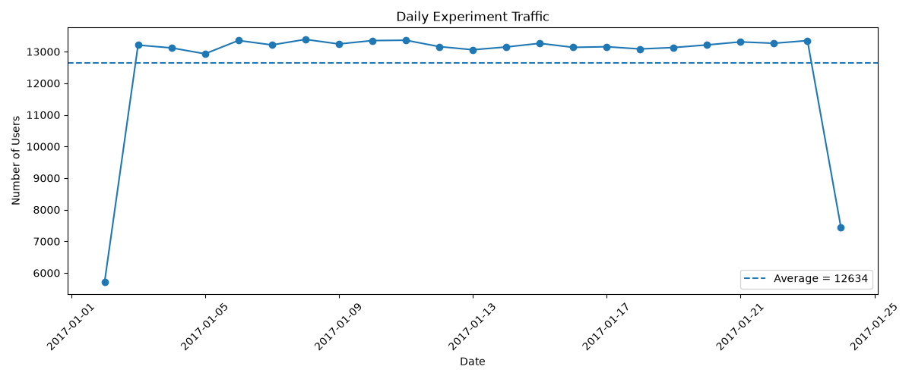
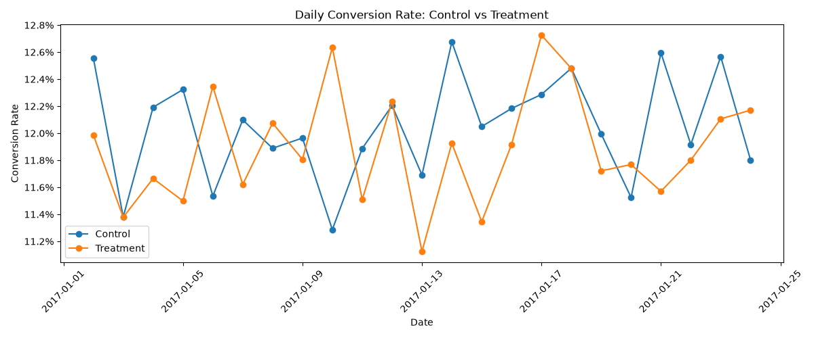
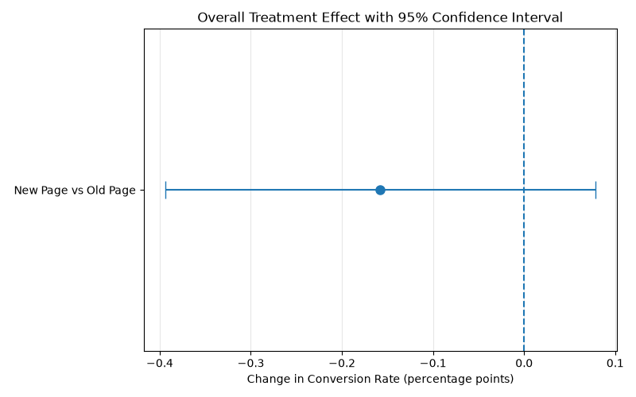

# A/B Testing Analysis: Landing Page Conversion

## Project Overview

This project evaluates an A/B test conducted to determine whether a newly designed landing page should replace the existing page.

The analysis focuses on both statistical validity and business decision-making. In addition to comparing conversion rates, the project examines experiment quality, statistical significance, confidence intervals, statistical power, traffic stability, and country-level performance.

**Business Question:**

> Should the company replace the existing landing page with the new page?

---

## Dataset

The experiment dataset contains user-level observations including:

- `user_id` – unique identifier for each user
- `timestamp` – time of experiment exposure
- `group` – control or treatment group
- `landing_page` – old page or new page
- `converted` – whether the user converted
- `country` – user country (US, UK, or CA)

After removing mismatched experiment assignments and duplicated users, the final analytical sample contained:

**290,584 unique users.**

---

## Data Cleaning & Validation

Before estimating the treatment effect, several data quality checks were performed.

### Missing Values

No missing values were found in the main experiment variables.

### Assignment Validation

Records where experiment assignment did not match the landing page were removed.

For example:

- Control users should receive the old page.
- Treatment users should receive the new page.

A total of **3,893 mismatched assignments** were identified and removed.

### Duplicate Users

After removing mismatched assignments, one duplicated user remained.

The duplicate record was removed to ensure that each user contributed only one observation to the experiment.

Final sample:

**290,584 users**

---

## Experiment Health Check

### Traffic Allocation

The cleaned experiment was almost perfectly balanced:

| Group | Users | Share |
|---|---:|---:|
| Control | 145,274 | 49.99% |
| Treatment | 145,310 | 50.01% |

A Sample Ratio Mismatch (SRM) test was conducted to determine whether the observed allocation differed unexpectedly from the intended 50/50 split.

**SRM p-value = 0.947**

The result provides no evidence of abnormal traffic allocation.

### Experiment Duration

The experiment ran for approximately **22 days**, from January 2 to January 24, 2017.

Daily traffic was generally stable during the full experiment days. Lower traffic on the first and last dates reflects partial-day observations.

---

## A/B Test Results

| Metric | Control | Treatment |
|---|---:|---:|
| Users | 145,274 | 145,310 |
| Conversions | 17,489 | 17,264 |
| Conversion Rate | 12.0386% | 11.8808% |

The observed treatment effect was:

- **Absolute change:** -0.1578 percentage points
- **Relative change:** -1.31%

The new page therefore did not produce an observed improvement in conversion.

### Statistical Significance

A two-proportion Z-test was used to compare the conversion rates.

**p-value = 0.1899**

At a 5% significance level, the difference is not statistically significant.

### 95% Confidence Interval

The estimated treatment effect was:

**-0.1578 percentage points**

with a 95% confidence interval of:

**[-0.3938 pp, +0.0781 pp]**

Because the confidence interval includes zero, the experiment does not provide sufficient evidence that the new page improves conversion.

---

## Country-Level Analysis

Treatment effects were also examined separately across the US, UK, and Canada.

| Country | Control Rate | Treatment Rate | Relative Uplift | p-value |
|---|---:|---:|---:|---:|
| US | 12.0630% | 11.8466% | -1.79% | 0.1323 |
| UK | 12.0022% | 12.1171% | +0.96% | 0.6349 |
| CA | 11.8783% | 11.1902% | -5.79% | 0.1947 |

None of the country-level differences were statistically significant.

Although the direction of the estimated treatment effect varies across countries, the available evidence does not support a reliable country-specific improvement.

---

## Business Recommendation

### Decision: Do Not Ship the New Page

The experiment does not provide sufficient evidence that the new landing page improves conversion.

The treatment group produced a slightly lower observed conversion rate than the control group, while the difference was not statistically significant.

Therefore, replacing the existing page with the new design is not supported by the current experiment.

Recommended next steps include:

1. Keep the existing landing page as the default experience.
2. Investigate which design elements of the new page may have affected user behavior.
3. Develop new page variants based on clearer hypotheses rather than deploying the current treatment.
4. Run a follow-up experiment if a materially different design is developed.
5. Continue monitoring potential heterogeneous effects across user segments.

---

## Key Visualizations

### Daily Experiment Traffic

Daily traffic remained stable during the main experiment period, while the lower counts on the first and last dates reflect partial-day observations.

### Daily Conversion Rate

Daily conversion rates fluctuated for both groups, with no persistent treatment advantage visible over the experiment period.

### Overall Treatment Effect

The estimated treatment effect is negative, while the 95% confidence interval crosses zero, indicating that the observed difference is not statistically significant.

---

## Tools & Methods

**Python**

- pandas
- NumPy
- SciPy
- statsmodels
- Matplotlib

**Analytical Methods**

- Data cleaning and experiment validation
- Sample Ratio Mismatch (SRM) testing
- Conversion funnel analysis
- Two-proportion Z-test
- Confidence interval estimation
- Statistical power and minimum detectable effect analysis
- Time-series experiment monitoring
- Segment-level analysis

---

## Key Takeaway

A statistically valid experiment does not necessarily produce a winning treatment.

In this test, the new landing page showed a small negative observed effect and no statistically significant improvement. The evidence therefore supports retaining the existing page while developing and testing stronger design hypotheses.